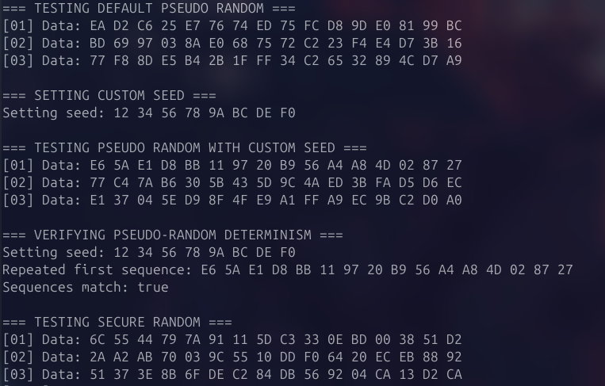
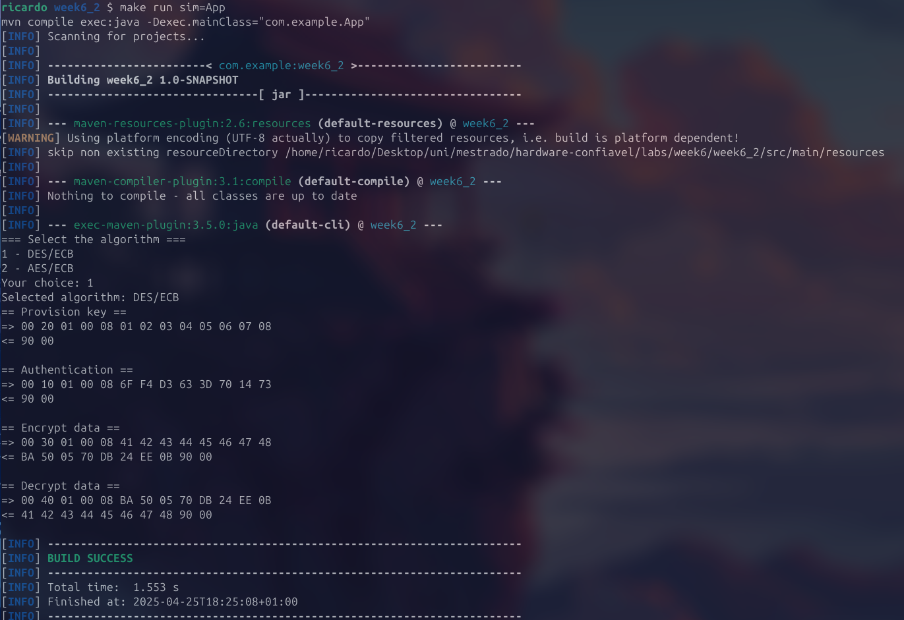
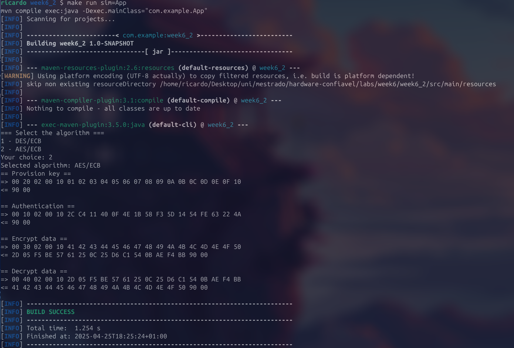

# Exercício 1

Foi criado o ficheiro `RandomApplet.java` que contém a implementação de um gerador de números aleatórios.

O *applet* aceita APDUs que levam como argumento o número de *bytes* de dados aleatórios que deve ser retornado na APDU de resposta.
Desta forma, o *applet* foi implementado para interpretar comandos APDU que seguem o formato `ISO 7816`. Cada campo da APDU tem uma função específica:
- `CLA` = `0x00`: classe ISO padrão;
- `INS` = `0x50`: instrução `INS_GET_RANDOM`, para pedir *bytes* aleatórios;
- `P1` = `0x00` ou `0x01`: seleciona o tipo de gerador (pseudo ou seguro);
- `LC`: especifica o número de *bytes* aleatórios pretendido.


```java
    byte[] apdu = new byte[5];
    apdu[0] = (byte) 0x00;  // CLA
    apdu[1] = INS_GET_RANDOM;  // INS
    apdu[2] = generatorType;  // P1: generator type
    apdu[3] = (byte) 0x00;  // P2: not used
    apdu[4] = numBytes;  // Lc: length of data to generate
```
## a) Inicialização do *Applet*

Durante a instalação do *applet*, é possível definir o tipo de gerador de dados aleatórios que vai ser utilizado. Se o valor de `param` for 1, o *applet* é configurado para utilizar o gerador pseudoaleatório - `RandomData.ALG_PSEUDO_RANDOM`. Caso contrário, se o valor for 0, o *applet* vai utilizar o gerador aleatório seguro - `RandomData.ALG_SECURE_RANDOM`. Assim, o *applet* tornou-se flexível ao permitir que o comportamento do gerador de aleatoriedade seja definido dinamicamente no momento da sua instalação.


Se não existir suporte ao `RandomData.ALG_SECURE_RANDOM`, a exceção é tratada com o `ISOException.throwIt(ISO7816.SW_DATA_INVALID)`.

```java
try {
    secureRandom = RandomData.getInstance(RandomData.ALG_SECURE_RANDOM);
} catch (CryptoException e) {
    // If secure random not available, throw a defined status word
    ISOException.throwIt(ISO7816.SW_FUNC_NOT_SUPPORTED);
}
``` 

## b) Testes Realizados

Os testes foram realizados com o simulador `jCardSim`, enviando APDUs para:
- Gerar múltiplos conjuntos de 16 bytes de dados aleatórios;
- Verificar o comportamento do `PSEUDO_RANDOM` com e sem `setSeed()`;
- Confirmar se o `SECURE_RANDOM` gera sequências diferentes por chamada;
- Verificar se os geradores mantêm consistência entre execuções.


Os resultados obtidos foram:




Inicialmente, com a *seed* padrão definida no *applet*, o gerador pseudoaleatório produziu três sequências distintas, como seria esperado de um gerador que evolui a partir de um estado inicial fixo. Este comportamento confirma que, apesar de a *seed* ser sempre a mesma, chamadas consecutivas ao gerador produzem *outputs* diferentes, uma vez que o seu estado interno é atualizado a cada utilização.

Em seguida, foi definida uma nova *seed* personalizada (`12 34 56 78 9A BC DE F0`). A partir dessa *seed*, as novas sequências geradas voltaram a apresentar variação a cada chamada, demonstrando que o gerador mantém um comportamento pseudoaleatório robusto. Para confirmar o determinismo do `PSEUDO_RANDOM`, foi reaplicada a mesma *seed*, e a sequência gerada coincidiu exatamente com a primeira sequência após a inicialização anterior. Isto demonstra que o gerador é completamente determinístico e que a função `setSeed()` reinicia corretamente o estado interno.

Já o gerador `SECURE_RANDOM` apresentou um comportamento diferente. Foram realizadas três chamadas consecutivas e os dados gerados foram sempre diferentes, demonstrando um comportamento não determinístico, tal como se espera de um gerador de entropia segura. Contudo, verificações adicionais indicaram que, em execuções diferentes do programa, os valores gerados pelo `SECURE_RANDOM` podem repetir-se, o que denuncia uma limitação do simulador `jCardSim`, que aparentemente não reinicia o estado com entropia real.

Em conclusão, o gerador `PSEUDO_RANDOM` demonstrou um comportamento totalmente previsível e controlável, sendo ideal para testes reprodutíveis e para ambientes onde se exige consistência. O `SECURE_RANDOM`, embora simule aleatoriedade entre chamadas dentro da mesma execução, não garante aleatoriedade entre execuções, comprometendo a sua fiabilidade em contexto simulado. Num cartão físico real, espera-se que esta limitação não se verifique, e que o `SECURE_RANDOM` forneça dados verdadeiramente imprevisíveis, tornando-o adequado para operações criptográficas seguras.

Após investigação adicional, concluiu-se que, embora o conceito de utilizar entropia real no `jCardSim` seja interessante, não existe um método direto ou padrão para o fazer. Qualquer solução neste sentido provavelmente exigiria integrações personalizadas ou modificações internas ao simulador. Assim, para testes de segurança críticos que exijam fontes de entropia autêntica, recomenda-se a utilização de *hardware* real, nomeadamente Java Cards físicos, para garantir a qualidade e imprevisibilidade dos dados aleatórios gerados.

# Exercício 2 

O *applet* desenvolvido encontra-se em `CryptoApplet.java` e nele destacam-se as seguintes características:

## a) Alocação de Memória

Foi analisado o código do `DESApplet.java`. Concluiu-se que reservar espaço para o output das operações como um novo em EPROM `outBuff= newbyte[Lc];` não é a melhor prática em JavaCard. 

Primeiramente, a alocação de arrays através do `new byte[Lc]` cria dados persistentes, é significativamente mais lento que a RAM e só podem ser escritos/apagados um número limitado de vezes. Esta memória foi projetada para armazenar dados permanentes e não temporários. Ao armazenar resultados voláteis como encriptações/desencriptações pode levar a degradação do desempenho e do cartão e possível exposição dos dados a riscos de segurança, uma vez que a memória persistente mantém os dados após a execução.

Da mesma forma, a alocação dinâmica de *arrays* durante a execução pode falhar, porque alguns cartões JavaCard impõem restrições à alocação de memória após a instalação (*post-issuance memory allocation*), o que faz com que esta implementação não seja suportada. Existe, também, o risco de exceções na execução (`SystemException.NO_RESOURCE`), caso a memória esteja fragmentada ou não esteja disponível. 

Assim, a utilização do `new byte[Lc]` deve ser evitada. A abordagem recomendada consiste em alocar o *buffer* em RAM transitória (apagada ao deselecionar o *applet*), através de `JCSystem.makeTransientByteArray()`. Este *buffer* é reutilizado em todas as operações de cifra/decifra, o que melhora o desempenho e preserva a vida útil da memória.

## b) Verificação de Tamanho de Bloco e Gestão de *Buffers*

No modo `ALG_DES_ECB_NOPAD`, como o próprio nome indica, não existe qualquer mecanismo automático de padding. Assim, o número de bytes que ciframos ou deciframos deve obrigatoriamente ser um múltiplo de 8. Esta verificação é feita corretamente no código através da condição:

```java
if ((length % blockSize) != 0)
    ISOException.throwIt(ISO7816.SW_WRONG_LENGTH);
```

 Para o modo `ALG_AES_ECB_NOPAD`, o tamanho do bloco é de 16 bytes, e aplica-se exatamente a mesma lógica de verificação, ou seja, o tamanho do *input* deve ser múltiplo de 16.

Relativamente à gestão de *buffers*, o código final garante que o tamanho dos blocos é validado corretamente e utiliza um buffer de saída (`tempBuffer`) com capacidade de 256 *bytes*, o que é suficiente para a maioria dos casos. No entanto, em situações reais, seria mais correto calcular dinamicamente o tamanho necessário do *buffer*, para acomodar cenários onde exista padding automático. Nestes casos, seria ideal adaptar o tamanho do *buffer* dinamicamente ou reservar logo à partida o maior espaço necessário, evitando assim riscos de *overflow* e aumentando a robustez da solução.

## c) Autenticação e Validação do Terminal

O *applet* possui um `adminChallenge` fixo de 8 *bytes*. A autenticação exige que o terminal envie esse desafio cifrado com a chave correta, podendo ser uma chave DES ou AES. O *applet* então decifra o desafio recebido e compara com o valor esperado. Se a verificação for bem-sucedida, o estado `isAuthenticated` é definido como verdadeiro. 

## d) Conjunto de Instruções APDU e Operações

Para permitir a gestão de chaves e a execução de operações de cifra e decifra no *applet* desenvolvido, foi definido um conjunto de instruções APDU e as respetivas operações associadas:

| INS   | Operação      | P1 (Algoritmo)  | Dados               |
|-------|---------------|-----------------|---------------------|
| `0x10`  | AUTHENTICATE  | `0x01` ou `0x02`    | Challenge cifrado   |
| `0x20`  | PROVISION_KEY | `0x01` ou `0x02`    | Chave a instalar    |
| `0x30`  | ENCRYPT       | `0x01` ou `0x02`    | Dados a cifrar      |
| `0x40`  | DECRYPT       | `0x01` ou `0x02`    | Dados a decifrar    |

A autenticação (INS = `0x10`) valida o terminal, isto é, o desafio cifrado enviado pelo terminal é decifrado e comparado pelo *applet* para confirmar a autenticidade. O provisionamento de chave (INS = `0x20`) permite carregar uma nova chave secreta no *applet* após autenticação prévia.

---

Para validar o funcionamento correto do *applet*, foram realizados testes utilizando dois algoritmos de cifra distintos: `ALG_DES_ECB_NOPAD` e `ALG_AES_ECB_NOPAD`. Cada teste consistiu em:

- Aprovisionamento de uma chave para o algoritmo selecionado;
- Autenticação utilizando um desafio cifrado com a respetiva chave;
- Cifra de um conjunto de dados de teste;
- Decifra dos dados cifrados para verificar a recuperação correta da informação original.

### Resultados Obtidos

**Para o algoritmo `ALG_DES_ECB_NOPAD`**:
- O processo de aprovisionamento da chave foi bem-sucedido (`90 00`).
- A autenticação decorreu sem erros, confirmando que o *applet* conseguiu decifrar corretamente o desafio cifrado.
- A cifra dos dados produziu um *ciphertext* consistente.
- A operação de decifra recuperou exatamente o texto original, confirmando que a chave e o algoritmo estavam corretamente configurados.



**Para o algoritmo `ALG_AES_ECB_NOPAD`**:
- De forma semelhante, o aprovisionamento da chave AES também foi executado com sucesso.
- A autenticação baseada em AES foi realizada sem falhas.
- Os dados cifrados foram corretamente produzidos e posteriormente decifrados, verificando-se que o plaintext original foi restaurado na íntegra.




