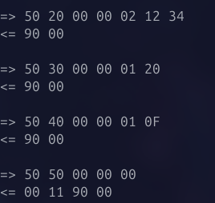
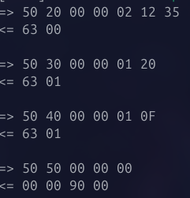
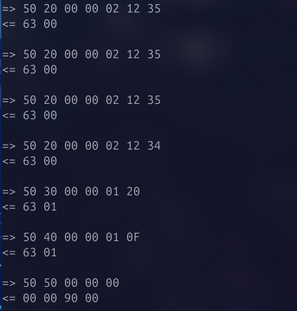
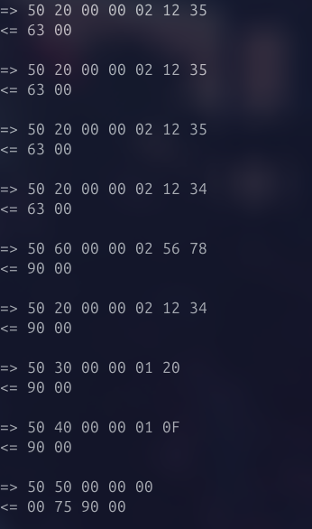

# Exercício 1

Foi descarregado o JavaCard SDK 2.2.2.

# Exercício 2

O exemplo executado, no simulador **jCardSim**, utilizou a ferramenta **APDUScriptTool** para simular a execução de comandos **APDU** num *applet* **Java Card**.

Criou-se o ficheiro ```jcardsim.cfg``` com ```{index}``` = 0, segundo o exemplo. Este ficheiro de configuração foi utilizado para definir o **AID** e a classe do *applet* a ser utilizado no simulador.

``` java 
com.licel.jcardsim.card.applet.0.AID=010203040506070809
com.licel.jcardsim.card.applet.0.Class=com.licel.jcardsim.samples.HelloWorldApplet
```

Adicionalmente, criou-se o ***script*** ```helloworld.apdu```:

``` java
// CREATE APPLET CMD
0x80 0xb8 0x00 0x00 0x10 0x9 0x01 0x02 0x03 0x04 0x05 0x06 0x07 0x08 0x09 0x05 0x00 0x00 0x02 0x0f 0x0f 0x7f;
// SELECT APPLET CMD
0x00 0xa4 0x00 0x00 0x09 0x01 0x02 0x03 0x04 0x05 0x06 0x07 0x08 0x09 0x02;
// TEST NOP
0x00 0x02 0x00 0x00 0x00 0x02;
// test hello world from card
0x00 0x01 0x00 0x00 0x00 0x0d;
// test echo
0x00 0x01 0x01 0x00 0x0d 0x48 0x65 0x6c 0x6c 0x6f 0x20 0x77 0x6f 0x72 0x6c 0x64 0x20 0x21 0x0d;
```
Estre *script* foi então executado e enviou sequências de comandos ao simulador, que respondeu com os resultados esperados, incluindo a mensagem *"Hello World !"*. Obteve-se o seguinte resultado:


# Exercício 3

De modo a simular um **Java Card** e reresolver os exercícios propostos, criou-se um projeto `Maven` com a seguinte dependência:

``` xml
<!-- https://mvnrepository.com/artifact/com.licel/jcardsim -->
<dependency>
    <groupId>com.licel</groupId>
    <artifactId>jcardsim</artifactId>
    <version>2.2.2</version>
</dependency>
```

Para além disso, para configurar o simulador, seguiu-se a documentação do [repositório oficial](https://github.com/licel/jcardsim).

## 3

Ao compilar e executar o código do *applet* **Echo**, através do `Maven`, com o comando `run sim=App`, obteve-se o seguinte:


A resposta (**R-ADPU**) obtida foi a esperada, já que é possível observar a mensagem *"Hello World !"* em hexadecimal.


---

O próximo passo foi, então, modificar o ficheiro `Echo.java`, com o objetivo do *applet* manter o **número de APDU processadas** e devolver na R-APDU o **complemento binário dos dados que recebe**. 

Para isso, foi adicionado um `apduCounter` que incrementa a cada APDU processada e uma linha que executa a operação **XOR**  de cada *byte* com **=0XFF**:

```java
for (short i = 0; i < bytesRead; i++) {
    echoBytes[echoOffset + i] = (byte) (buffer[ISO7816.OFFSET_CDATA + i] ^ (byte) 0xFF);
}
echoOffset += bytesRead;
```

Obteve-se o seguinte resultado:


A R-ADPU confirma-se pelo seguinte:


## 3.1

Inicialmente, foi compilado e executado o *applet* **Wallet**, através do `Maven`. O output obtido foi o seguinte:



No ficheiro `App.java` é criado um array *installData* com os dados da instalação do applet:

```java	
byte[] installData = new byte[] {
    (byte) aid.length,       // AID length (9)
    // AID (9 bytes)
    0x01, 0x02, 0x03, 0x04, 0x05, 0x06, 0x07, 0x08, 0x09,
    // PIN
    0x02,
    // PIN bytes
    0x12, 0x34
};
```

Cada linha de código abaixo simula uma ação do utilizador.

```java
send(simulator, new byte[] { 0x50, 0x20, 0x00, 0x00, 0x02, 0x12, 0x34 }); // Verifica PIN correto
send(simulator, new byte[] { 0x50, 0x30, 0x00, 0x00, 0x01, 0x20 }); // Credito
send(simulator, new byte[] { 0x50, 0x40, 0x00, 0x00, 0x01, 0x0F }); // Debito
send(simulator, new byte[] { 0x50, 0x50, 0x00, 0x00, 0x00 });       // Saldo
```

Depois de analisar o *applet* foi verificado o que acontece quando se manda o PIN incorreto.

```java
send(simulator, new byte[] { 0x50, 0x20, 0x00, 0x00, 0x02, 0x12, 0x35 }); // Verifica PIN incorreto
send(simulator, new byte[] { 0x50, 0x30, 0x00, 0x00, 0x01, 0x20 }); // Credito
send(simulator, new byte[] { 0x50, 0x40, 0x00, 0x00, 0x01, 0x0F }); // Debito
send(simulator, new byte[] { 0x50, 0x50, 0x00, 0x00, 0x00 });       // Saldo
```

A resposta foi a seguinte:



Assim, conseguimos ver que o resultado foi `63 00` e `63 01` que correspondem a verificação errada e verificação necessária, respetivamente. Abaixo, podemos ver a confirmação do resultado obtido, que se encontra no *applet* `Wallet.java`.

```java
final static short SW_VERIFICATION_FAILED = 0x6300;
final static short SW_PIN_VERIFICATION_REQUIRED = 0x6301;
```

De seguida, verificou-se o que acontece quando se manda várias vezes o PIN incorreto e de seguinda o PIN correto.

No *applet* `Wallet.java` observou-se que o número limite de tentativas são 3 e que, após 3 tentativas erradas, o PIN bloqueia. 

```java
final static byte PIN_TRY_LIMIT = (byte)0x03;
```

```java
send(simulator, new byte[] { 0x50, 0x20, 0x00, 0x00, 0x02, 0x12, 0x35 }); // Verifica PIN incorreto
send(simulator, new byte[] { 0x50, 0x20, 0x00, 0x00, 0x02, 0x12, 0x35 }); // Verifica PIN incorreto
send(simulator, new byte[] { 0x50, 0x20, 0x00, 0x00, 0x02, 0x12, 0x35 }); // Verifica PIN incorreto
send(simulator, new byte[] { 0x50, 0x20, 0x00, 0x00, 0x02, 0x12, 0x34 }); // Verifica PIN correto
send(simulator, new byte[] { 0x50, 0x30, 0x00, 0x00, 0x01, 0x20 }); // Credito
send(simulator, new byte[] { 0x50, 0x40, 0x00, 0x00, 0x01, 0x0F }); // Debito
send(simulator, new byte[] { 0x50, 0x50, 0x00, 0x00, 0x00 });       // Saldo
```



Assim, com base nos resultados obtidos, podemos concluir que, após três tentativas falhadas do PIN - onde todas devolvem `63 00`, mesmo a mandar o PIN correto resultou, novamente, em `63 00`. Isto indica que o PIN foi bloqueado após o número máximo de tentativas incorretas.

---

Foi modificado o código do *applet* de forma a que a sua inicialização aceitasse um PUK e foi alterado o valor inicial de saldo para 100.

```java	
byte[] installData = new byte[] {
    (byte) aid.length,       // AID length
    // AID
    0x01, 0x02, 0x03, 0x04, 0x05, 0x06, 0x07, 0x08, 0x09,
    // PIN, PUK length
    0x02, 0x02,
    // balance
    0x00, 0x64, // 100 
    // PIN bytes
    0x12, 0x34,
    // PUK Bytes
    0x56, 0x78
};
```

Fizeram-se mais algumas alterações no código do *applet* `Wallet` para que o mesmo aceitasse o PUK e desbloqueasse o PIN. As principais alterações estão abaixo representadas e o código completo encontra-se em `Wallet.java`.

```java
final static byte UNBLOCK_PIN = (byte) 0x60;
final static byte MAX_PUK_SIZE = (byte) 0x08;
final static byte PUK_TRY_LIMIT = (byte) 0x03;

OwnerPIN puk;

puk = new OwnerPIN(PUK_TRY_LIMIT, MAX_PUK_SIZE);

case UNBLOCK_PIN:
    unblockPIN(apdu);
    return;

private void unblockPIN(APDU apdu) {
    byte[] buffer = apdu.getBuffer();
    byte len = (byte)(apdu.setIncomingAndReceive());

    if (!puk.check(buffer, ISO7816.OFFSET_CDATA, len)) {
        ISOException.throwIt(ISO7816.SW_SECURITY_STATUS_NOT_SATISFIED);
    }
    pin.resetAndUnblock();
}
```

Após as alterações do *applet* `Wallet` compilou-se e executou-se o código - vai-se mandar 3 vezes o PIN incorreto, depois o PIN correto para se verificar que está bloqueado, o desbloqueio com o PUK, e por fim, o PIN correto para se verificar que o desbloqueio funcionou.

```java
send(simulator, new byte[] { 0x50, 0x20, 0x00, 0x00, 0x02, 0x12, 0x35 }); // Verifica PIN incorreto
send(simulator, new byte[] { 0x50, 0x20, 0x00, 0x00, 0x02, 0x12, 0x35 }); // Verifica PIN incorreto
send(simulator, new byte[] { 0x50, 0x20, 0x00, 0x00, 0x02, 0x12, 0x35 }); // Verifica PIN incorreto
send(simulator, new byte[] { 0x50, 0x20, 0x00, 0x00, 0x02, 0x12, 0x34 }); // Verifica PIN correto
send(simulator, new byte[] { 0x50, 0x60, 0x00, 0x00, 0x02, 0x56, 0x78 }); // Desbloqueio com PUK
send(simulator, new byte[] { 0x50, 0x20, 0x00, 0x00, 0x02, 0x12, 0x34 }); // Verifica PIN correto
send(simulator, new byte[] { 0x50, 0x30, 0x00, 0x00, 0x01, 0x20 }); // Credito
send(simulator, new byte[] { 0x50, 0x40, 0x00, 0x00, 0x01, 0x0F }); // Debito
send(simulator, new byte[] { 0x50, 0x50, 0x00, 0x00, 0x00 });       // Saldo
```

O resultado foi o seguinte:



Conseguimos observar que o resultado é `90 00`, que era o resultado certo que dava inicialmente.


