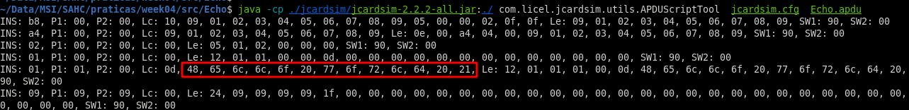
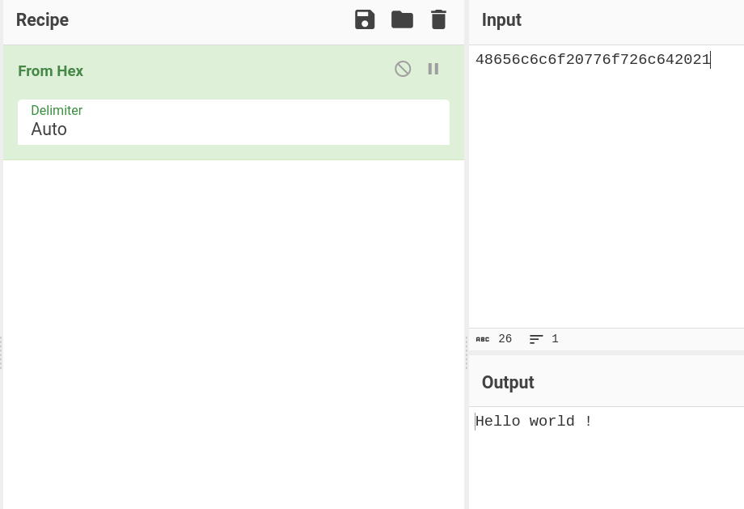
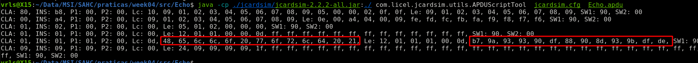
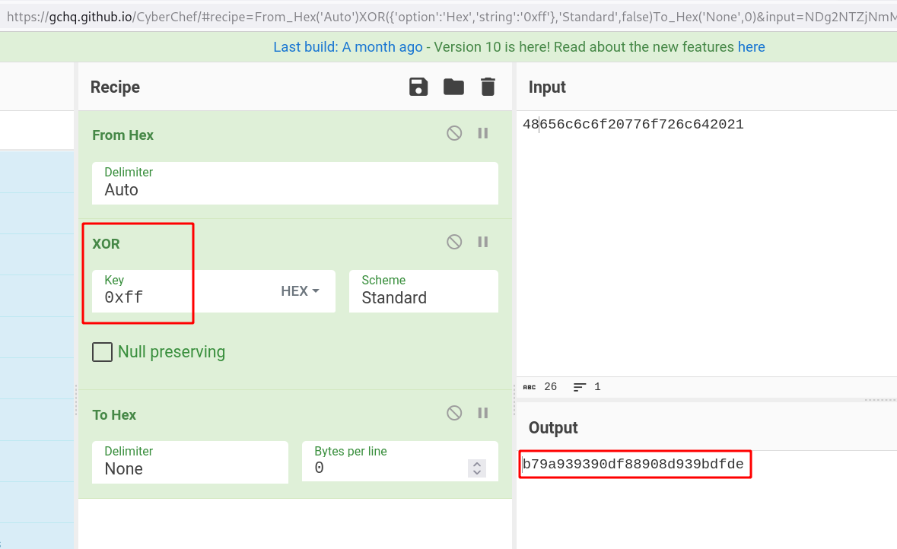
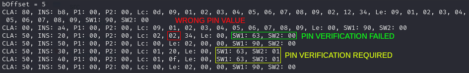
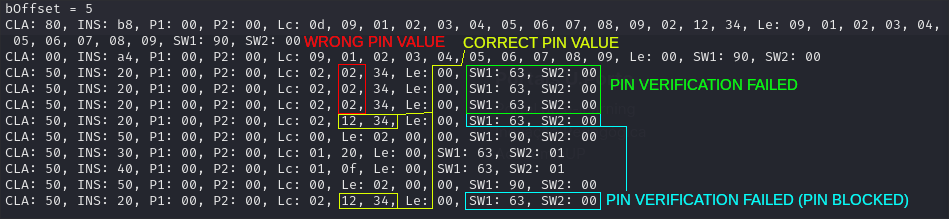

# Exercise 4.1

In this exercise we study the `Echo` Applet. This program is an applet that will in theory run on a Java Smart Card. It uses Java Card architecture and API's to provide functionality and connectivity with CAD devices (e.g. smart card readers) through APDU protocol.

In terms of features, the `Echo` applet provides the `install()` entrypoint and calls `register()` on the constructor.
Before registering the applet, it will allocate a buffer of `LENGTH_ECHO_BYTES` bytes. This buffer will be used to receive data from APDU, store the data in a byte array.

When the `process()` is called to process an incoming APDU, the applet will store the received data in `echoBytes` buffer and then *echoing*  the data back to the device.

To test this applet, we started by compiling the `Echo` applet, linking with `Java Card API`:
```bash
javac -g  -cp ./java_card_kit-2_2_2/lib/api.jar -source 1.5 -target 1.5 Echo/Echo.java
```

Then we converted the Java class file to CAP format (Java Converted APplet) by running, providing the AIDs:
```bash
./java_card_kit-2_2_2/bin/converter -debug -exportpath ./java_card_kit-2_2_2/api_export_files/ -applet 0x01:0x02:0x03:0x04:0x05:0x06:0x07:0x08:0x09 Echo.Echo Echo 0x01:0x02:0x03:0x04:0x05:0x06:0x07 1.0
```

After converting, two files were generated inside `Echo` package:
- ./Echo/javacard/Echo.cap
- ./Echo/javacard/Echo.exp

Finally we were able to run the applet by simulating a Java Card using JCardSim and providing `Echo.apdu` as input to interact with the applet:

```bash
java -cp ./jcardsim/jcardsim-2.2.2-all.jar:./ com.licel.jcardsim.utils.APDUScriptTool  jcardsim.cfg  Echo.apdu
CLA: 80, INS: b8, P1: 00, P2: 00, Lc: 10, 09, 01, 02, 03, 04, 05, 06, 07, 08, 09, 05, 00, 00, 02, 0f, 0f, Le: 09, 01, 02, 03, 04, 05, 06, 07, 08, 09, SW1: 90, SW2: 00
CLA: 00, INS: a4, P1: 00, P2: 00, Lc: 09, 01, 02, 03, 04, 05, 06, 07, 08, 09, Le: 0e, 00, a4, 04, 00, 09, 01, 02, 03, 04, 05, 06, 07, 08, 09, SW1: 90, SW2: 00
CLA: 01, INS: 02, P1: 00, P2: 00, Lc: 00, Le: 05, 01, 02, 00, 00, 00, SW1: 90, SW2: 00
CLA: 01, INS: 01, P1: 00, P2: 00, Lc: 00, Le: 12, 01, 01, 00, 00, 0d, 00, 00, 00, 00, 00, 00, 00, 00, 00, 00, 00, 00, 00, SW1: 90, SW2: 00
CLA: 01, INS: 01, P1: 01, P2: 00, Lc: 0d, 48, 65, 6c, 6c, 6f, 20, 77, 6f, 72, 6c, 64, 20, 21, Le: 12, 01, 01, 01, 00, 0d, 48, 65, 6c, 6c, 6f, 20, 77, 6f, 72, 6c, 64, 20, 21, SW1: 90, SW2: 00
CLA: 09, INS: 09, P1: 09, P2: 09, Lc: 00, Le: 24, 09, 09, 09, 09, 1f, 00, 00, 00, 00, 00, 00, 00, 00, 00, 00, 00, 00, 00, 00, 00, 00, 00, 00, 00, 00, 00, 00, 00, 00, 00, 00, 00, 00, 00, 00, 00, SW1: 90, SW2: 00

```

The APDU script has 6 lines of instructions. In resume, it will send a buffer to the applet, containing the byte array (string):
- `Hello world !`

The applet receives this string, stores in its buffer, and echoes it back.





## Exercise 4.1 a)


To solve this exercise we had to modify `Echo.java` applet. 
We introduced a new field `counter` of type `short` that will increment 1 everytime applet `process()` is called, and added a `for loop` that will iterate over `echoBuffer` byte array, calculate its complement using `^ bitwise XOR 0xFF` and store it back on the buffer, before echoing it back.


```java
public class Echo extends Applet {

	private byte[] echoBytes;
    private short counter;
    private static final short LENGTH_ECHO_BYTES = 256;
    
    protected Echo() {
	    echoBytes = new byte[LENGTH_ECHO_BYTES];
	    counter = 0;
	    register();
	}

	public static void install(byte[] bArray, short bOffset, byte bLength) {
		new Echo();
	}

	public void process(APDU apdu) {
		counter++; // ADDED
		byte buffer[] = apdu.getBuffer();
		short bytesRead = apdu.setIncomingAndReceive();
		short echoOffset = (short)0;
		
		while ( bytesRead > 0 ) {
			Util.arrayCopyNonAtomic(buffer, ISO7816.OFFSET_CDATA, echoBytes, echoOffset, bytesRead);
			echoOffset += bytesRead;
			bytesRead = apdu.receiveBytes(ISO7816.OFFSET_CDATA);
		}
		
		for (short i = 0; i < echoOffset; i++) {
			echoBytes[i] ^= (byte) 0xff;
		}
		
		apdu.setOutgoing();
		apdu.setOutgoingLength( (short) (echoOffset + 5) );

		// echo header
		apdu.sendBytes( (short)0, (short) 5);
		// echo data
		apdu.sendBytesLong( echoBytes, (short) 0, echoOffset );
	}
}
```







```
(Hello world !) 48656c6c6f20776f726c642021 XOR 0xFF = b79a939390df88908d939bdfde
```

# Exercise 4.2

In this exercise we study the `Wallet` Applet. This program is an applet that will simulate a wallet, on a Java Smart Card, and allows simple operations like checking the balance, depositing, and so on. As the previous Applet, it uses Java Card architecture and API's to provide functionality and connectivity with CAD devices (e.g. smart card readers) through APDU protocol.

This applet starts by declaring various constants and provides the `install()` entrypoint, where a new `Wallet` object is created. Here, an `OwnerPIN` object is initialized, with the number of incorrect PIN tries allowed and the maximum size of the PIN as arguments. The PIN is set according to the arguemnts passed in the APDU, and finally `register()` is called.

To test this applet, same as before, we compile it with:

`javac -g  -cp ./java_card_kit-2_2_2/lib/api.jar -source 1.5 -target 1.5 Wallet/Wallet.java`

And then we convert the Java class file to CAP format with:

`./java_card_kit-2_2_2/bin/converter -debug -exportpath ./java_card_kit-2_2_2/api_export_files/ -applet 0x01:0x02:0x03:0x04:0x05:0x06:0x07:0x08:0x09 Wallet.Wallet Wallet 0x01:0x02:0x03:0x04:0x05:0x06:0x07 1.0`

Finally, we run the Applet, by simulating a Java Card using JCardSim, and passing the provided `Wallet.apdu` file as input.

```bash
java -cp ./jcardsim/jcardsim-2.2.2-all.jar:./ com.licel.jcardsim.utils.APDUScriptTool  jcardsim.cfg  Wallet.apdu
bOffset = 5
CLA: 80, INS: b8, P1: 00, P2: 00, Lc: 0d, 09, 01, 02, 03, 04, 05, 06, 07, 08, 09, 02, 12, 34, Le: 09, 01, 02, 03, 04, 05, 06, 07, 08, 09, SW1: 90, SW2: 00
CLA: 00, INS: a4, P1: 00, P2: 00, Lc: 09, 01, 02, 03, 04, 05, 06, 07, 08, 09, Le: 00, SW1: 90, SW2: 00
CLA: 50, INS: 20, P1: 00, P2: 00, Lc: 02, 12, 34, Le: 00, SW1: 90, SW2: 00
CLA: 50, INS: 50, P1: 00, P2: 00, Lc: 00, Le: 02, 00, 00, SW1: 90, SW2: 00
CLA: 50, INS: 30, P1: 00, P2: 00, Lc: 01, 20, Le: 00, SW1: 90, SW2: 00
CLA: 50, INS: 40, P1: 00, P2: 00, Lc: 01, 0f, Le: 00, SW1: 90, SW2: 00
CLA: 50, INS: 50, P1: 00, P2: 00, Lc: 00, Le: 02, 00, 11, SW1: 90, SW2: 00

```

The APDU script has 7 lines of instructions. In resume, it will set the PIN, verify it (and thus have permission to perform operations), check the current balance, credit the value of 32 and debit 15. The balance is checked again, and as we can confirm in the output above (last line, 4th byte from the right), the last balance has a value of 17 (0x11).

To better understand the Applet, we started by changing the value of the PIN in the verification. As it can be seen, the verification failed. So, both the credit and debit operations failed. Since the operation to check the balance does not need verification, it is possible to see that the balance was not altered (the 4th and last lines are the same).



Next, we modified the APDU file to give an incorrect PIN 3 times. Then it would give the correct PIN, try the same operations again and try the PIN one last time.



We can observe that, after 3 tries, the PIN is blocked. When the correct PIN is entered, an verification failed answer is given. Even after some operations, the PIN will still be blocked.
