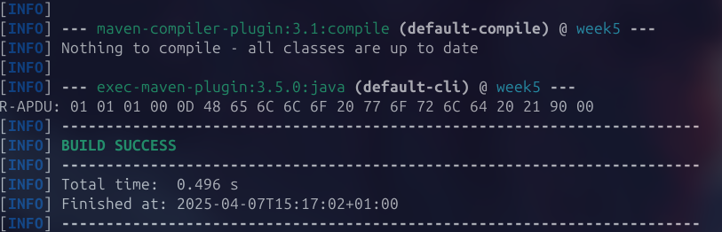

# Exercício 1

Foi descarregado o JavaCard SDK 2.2.2.

# Exercício 2

O exemplo executado, no simulador **jCardSim**, utilizou a ferramenta **APDUScriptTool** para simular a execução de comandos **APDU** num *applet* **Java Card**.

Criou-se o ficheiro ```jcardsim.cfg``` com ```{index}``` = 0, segundo o exemplo. Este ficheiro de configuração foi utilizado para definir o **AID** e a classe do *applet* a ser utilizado no simulador.

``` java 
com.licel.jcardsim.card.applet.0.AID=010203040506070809
com.licel.jcardsim.card.applet.0.Class=com.licel.jcardsim.samples.HelloWorldApplet
```

Adicionalmente, criou-se o ***script*** ```helloworld.apdu```:

``` java
// CREATE APPLET CMD
0x80 0xb8 0x00 0x00 0x10 0x9 0x01 0x02 0x03 0x04 0x05 0x06 0x07 0x08 0x09 0x05 0x00 0x00 0x02 0x0f 0x0f 0x7f;
// SELECT APPLET CMD
0x00 0xa4 0x00 0x00 0x09 0x01 0x02 0x03 0x04 0x05 0x06 0x07 0x08 0x09 0x02;
// TEST NOP
0x00 0x02 0x00 0x00 0x00 0x02;
// test hello world from card
0x00 0x01 0x00 0x00 0x00 0x0d;
// test echo
0x00 0x01 0x01 0x00 0x0d 0x48 0x65 0x6c 0x6c 0x6f 0x20 0x77 0x6f 0x72 0x6c 0x64 0x20 0x21 0x0d;
```
Estre *script* foi então executado e enviou sequências de comandos ao simulador, que respondeu com os resultados esperados, incluindo a mensagem *"Hello World !"*. Obteve-se o seguinte resultado:


# Exercício 3

De modo a simular um **Java Card** e reresolver os exercícios propostos, criou-se um projeto `Maven` com a seguinte dependência:

``` xml
<!-- https://mvnrepository.com/artifact/com.licel/jcardsim -->
<dependency>
    <groupId>com.licel</groupId>
    <artifactId>jcardsim</artifactId>
    <version>2.2.2</version>
</dependency>
```

Para além disso, para configurar o simulador, seguiu-se a documentação do [repositório oficial](https://github.com/licel/jcardsim).

## 3.1

Ao executar o código do *applet* **Echo**, através do `Maven`, com o comando `run sim=App`, obteve-se o seguinte:



A resposta (**R-ADPU**) obtida foi a esperada, já que é possível observar a mensagem *"Hello World !"* em hexadecimal.


## 3.2

O próximo passo foi, então, modificar o ficheiro `Echo.java`, com o objetivo do *applet* manter o **número de APDU processadas** e devolver na R-APDU o **complemento binário dos dados que recebe**. 

Para isso, foi adicionado um `apduCounter` que incrementa a cada APDU processada e uma linha que executa a operação **XOR**  de cada *byte* com **=0XFF**:


Obteve-se o seguinte resultado:


A R-ADPU confirma-se pelo seguinte:


