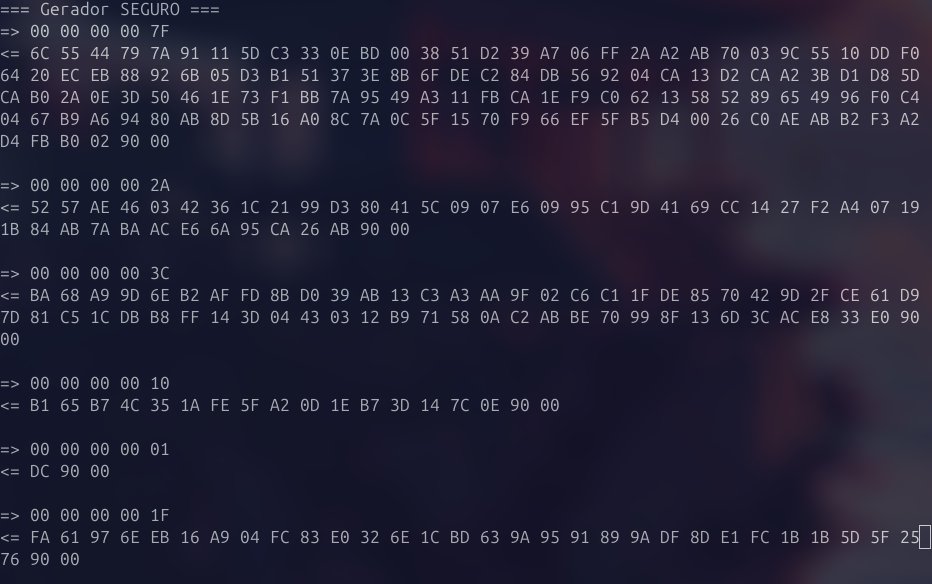
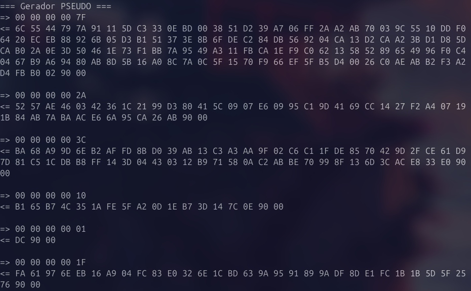

# Exercício 1

Foi criado o ficheiro `RandomApplet.java` que contém a implementação de um gerador de números aleatórios.

O *applet* aceita APDUs que levam como argumento o número de bytes de dados aleatórios que deve ser retornado na APDU de resposta.
Desta forma, o *applet* foi implementado para interpretar comandos APDU que seguem o formato `ISO 7816`. Cada campo da APDU tem uma função específica:
 - O campo `CLA` tem o valor `00`, que representa a classe ISO padrão utilizada.

 - O campo `INS` também tem o valor `00` e corresponde à instrução `INS_GET_RANDOM` definida no applet, responsável por aplicar a geração dos dados aleatórios.

 - Os campos `P1` e `P2` não são utilizados neste applet e, por convenção, são definidos com o valor `00`.

 - O campo `Lc` especifica o número de bytes aleatórios (em hexadecimal) que o *applet* deve gerar e retornar na resposta.

```java
short length = (short) (buffer[ISO7816.OFFSET_LC] & 0xFF);

randomGenerator.generateData(buffer, (short) 0, length);
apdu.setOutgoingAndSend((short) 0, length);

send(simPseudo, new byte[] { 0x00,    // CLA
                             0x00,    // INS
                             0x00,    // P2
                             0x00,    // P1
                             0x7F }); // Lc
```

Durante a instalação do *applet*, é possível definir o tipo de gerador de dados aleatórios que vai ser utilizado. Se o valor de `param` for 1, o *applet* é configurado para utilizar o gerador pseudoaleatório - `RandomData.ALG_PSEUDO_RANDOM`. Caso contrário, se o valor for 0, o *applet* vai utilizar o gerador aleatório seguro - `RandomData.ALG_SECURE_RANDOM`. Assim, tornou-se o *applet* flexível ao permitir que o comportamento do gerador de aleatoriedade seja definido dinamicamente no momento da sua instalação.

```java
byte algType = RandomData.ALG_SECURE_RANDOM;
if (bLength > 0) {
    byte param = bArray[(short) (bOffset)];
    algType = (param == 1) ? RandomData.ALG_PSEUDO_RANDOM : RandomData.ALG_SECURE_RANDOM;
}
```

Se não existir suporte ao `RandomData.ALG_SECURE_RANDOM`, a exceção é tratada com o `ISOException.throwIt(ISO7816.SW_DATA_INVALID)`.

```java
try {
    randomGenerator = RandomData.getInstance(algType);
} catch (CryptoException e) {
    if (e.getReason() == CryptoException.NO_SUCH_ALGORITHM) {
        ISOException.throwIt(ISO7816.SW_FUNC_NOT_SUPPORTED);
    }
    throw e;
}   
``` 

Foram efetuados vários testes para cada gerador. Os testes consistiram no envio de comandos APDU com diferentes tamanhos de dados, variando entre 1 e 127 bytes. Esta abordagem permitiu observar o comportamento dos geradores com pedidos de tamanhos pequenos, médios e grandes. Os testes encontram-se abaixo.

```java
System.out.println("=== Gerador SEGURO ===");
Simulator simSecure = new Simulator();
simSecure.installApplet(AppletAID, RandomApplet.class, new byte[]{ 0 }, (short) 0, (byte) 1);
simSecure.selectApplet(AppletAID);
send(simSecure, new byte[] { 0x00, 0x00, 0x00, 0x00, 0x7F });
send(simSecure, new byte[] { 0x00, 0x00, 0x00, 0x00, 0x2A });
send(simSecure, new byte[] { 0x00, 0x00, 0x00, 0x00, 0x3C });
send(simSecure, new byte[] { 0x00, 0x00, 0x00, 0x00, 0x10 });
send(simSecure, new byte[] { 0x00, 0x00, 0x00, 0x00, 0x01 });
send(simSecure, new byte[] { 0x00, 0x00, 0x00, 0x00, 0x1F });

System.out.println("=== Gerador PSEUDO ===");
Simulator simPseudo = new Simulator();
simPseudo.installApplet(AppletAID, RandomApplet.class, new byte[]{ 1 }, (short) 0, (byte) 1);
simPseudo.selectApplet(AppletAID);
send(simPseudo, new byte[] { 0x00, 0x00, 0x00, 0x00, 0x7F });
send(simPseudo, new byte[] { 0x00, 0x00, 0x00, 0x00, 0x2A });
send(simPseudo, new byte[] { 0x00, 0x00, 0x00, 0x00, 0x3C });
send(simPseudo, new byte[] { 0x00, 0x00, 0x00, 0x00, 0x10 });
send(simPseudo, new byte[] { 0x00, 0x00, 0x00, 0x00, 0x01 });
send(simPseudo, new byte[] { 0x00, 0x00, 0x00, 0x00, 0x1F });
```

Os resultados obtidos foram:





Apesar da diversidade dos testes, não foram observadas diferenças visíveis entre os dois geradores. Em ambos os casos, os dados retornados parecem aleatórios e não apresentam repetições ou padrões.

Assim, conclui-se que, no contexto da simulação e com os testes realizados, o comportamento dos dois geradores foi semelhante. 
