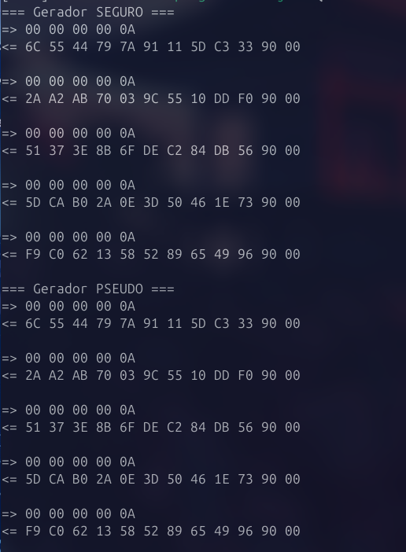

# Exercício 1

Foi criado o ficheiro `RandomApplet.java` que contém a implementação de um gerador de números aleatórios. Este gerador é capaz de gerar números aleatórios seguros e pseudo-aleatórios. O código do gerador é o seguinte:


Durante a instalação do *applet*, é possível definir o tipo de gerador de dados aleatórios que vai ser utilizado. Este parâmetro é recebido no `bArray`, que contém os dados fornecidos no momento da instalação do applet.

O primeiro byte deste array (param) é interpretado para decidir qual tipo de gerador utilizar:

Se o valor de param for 1, o applet é configurado para utilizar o gerador pseudoaleatório, designado por RandomData.ALG_PSEUDO_RANDOM.

Caso contrário — por exemplo, se o valor for 0 — o applet utiliza o gerador aleatório seguro, representado por RandomData.ALG_SECURE_RANDOM.

Este mecanismo torna o applet flexível, permitindo que o comportamento do gerador de aleatoriedade seja definido dinamicamente no momento da sua instalação

```java
byte algType = RandomData.ALG_SECURE_RANDOM;
if (bLength > 0) {
    byte param = bArray[(short) (bOffset)];
    algType = (param == 1) ? RandomData.ALG_PSEUDO_RANDOM : RandomData.ALG_SECURE_RANDOM;
}
```

Se não existir suporte ao `RandomData.ALG_SECURE_RANDOM`, a exceção é tratada com o `ISOException.throwIt(ISO7816.SW_DATA_INVALID)`.

```java
try {
    randomGenerator = RandomData.getInstance(algType);
} catch (CryptoException e) {
    if (e.getReason() == CryptoException.NO_SUCH_ALGORITHM) {
        ISOException.throwIt(ISO7816.SW_FUNC_NOT_SUPPORTED);
    }
    throw e;
}   
``` 

Foram efetuados vários testes para cada gerador. Os testes encontram-se abaixo.

```java
System.out.println("=== Gerador SEGURO ===");
Simulator simSecure = new Simulator();
simSecure.installApplet(AppletAID, RandomApplet.class, new byte[]{ 0 }, (short) 0, (byte) 1);
simSecure.selectApplet(AppletAID);
send(simSecure, new byte[] { 0x00, 0x00, 0x00, 0x00, 0x0A });
send(simSecure, new byte[] { 0x00, 0x00, 0x00, 0x00, 0x0A });
send(simSecure, new byte[] { 0x00, 0x00, 0x00, 0x00, 0x0A });
send(simSecure, new byte[] { 0x00, 0x00, 0x00, 0x00, 0x0A });
send(simSecure, new byte[] { 0x00, 0x00, 0x00, 0x00, 0x0A });

System.out.println("=== Gerador PSEUDO ===");
Simulator simPseudo = new Simulator();
simPseudo.installApplet(AppletAID, RandomApplet.class, new byte[]{ 1 }, (short) 0, (byte) 1);
simPseudo.selectApplet(AppletAID);
send(simPseudo, new byte[] { 0x00, 0x00, 0x00, 0x00, 0x0A });
send(simPseudo, new byte[] { 0x00, 0x00, 0x00, 0x00, 0x0A });
send(simPseudo, new byte[] { 0x00, 0x00, 0x00, 0x00, 0x0A });
send(simPseudo, new byte[] { 0x00, 0x00, 0x00, 0x00, 0x0A });
send(simPseudo, new byte[] { 0x00, 0x00, 0x00, 0x00, 0x0A });
```

Os resultados obtidos foram:



Assim, conseguimos concluir que 
